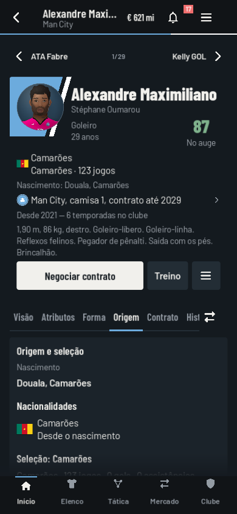
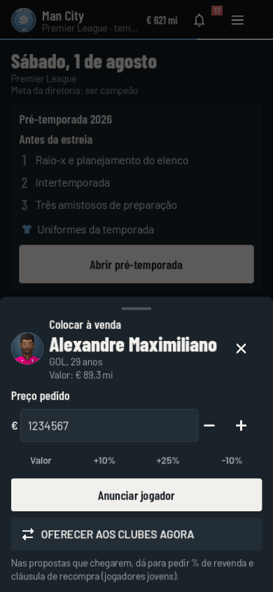
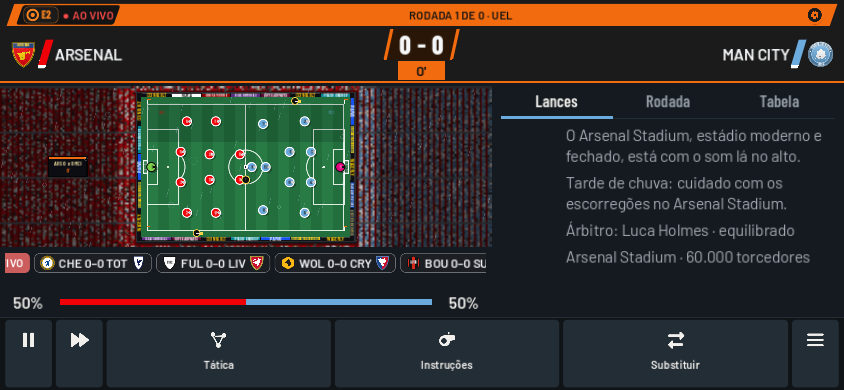

# Mais Uma Rodada 0.5.2 — revisão para Android

Base: UI 2.0 (`claude/gallant-hawking-3csszp`, 3074775). Branch de revisão: `fix/ui-match-champions-0.5.0`. Inclui o checkpoint 0.5.1 de proteção da simulação, Champions e memória de retratos. Não altera a main.

## O que mudou

- **Menu em retrato:** corrige o VBox adicionado a dois pais; todas as seções e o fechamento ficam disponíveis. Linhas maiores para toque.
- **Jogador:** reorganiza nome, retrato, avaliação e metadados; histórico estreito separa identificação da temporada e estatísticas. Mostra a passagem atual no clube, incluindo retornos e empréstimos. Nova aba Origem.
- **Negociações:** valor e salário aceitam digitação e teclado numérico, com conversão da moeda selecionada. Valores inválidos bloqueiam envio; o resumo financeiro acompanha a edição. Aceitar contraproposta atualiza o campo. Atalhos +/- continuam disponíveis.
- **Confrontos:** busca de adversário no menu, no clube e no pré-jogo, totais V/E/D e gols, placares recentes e primeiro/último encontro registrados. Os totais são cumulativos; a lista de partidas segue o limite de memória existente.
- **Simular:** executa o mesmo motor sem construir apresentação visual e comentários descartados durante simulação em lote. Mantém proteção contra ações simultâneas e gravação concorrente do checkpoint 0.5.1.
- **Match day:** placares e rituais específicos para UCL, UEL e Conference; UEL/Conference deixam de usar a estrela da Champions. Identidade das ligas preservada em retrato e paisagem; introdução inclui retrospecto e tempo de clube do destaque.
- **Europa:** UEL com 36 clubes/8 jogos, Conference com 36/6; Conference enfrenta um adversário de cada um dos seis potes, três em casa e três fora. Playoffs 9º–24º; oito primeiros nas oitavas. Campeão da Conference disputa a UEL seguinte salvo vaga doméstica na Champions. Torneios de saves antigos terminam no formato iniciado.
- **Seleções:** Mundial de 48, Euro/África/Ásia de 24, Copa América/Ouro de 16, OFC de 8; terceiros lugares quando previstos. Acrescenta UEFA/Concacaf Nations League com divisões, grupos, quartas, final four, acessos/descensos e caminho da Copa Ouro. Cadastro ampliado para 218 federações, das quais 211 filiadas à FIFA; quem não tem arte de bandeira mostra o código da federação.

## Nacionalidades e naturalização

O gerador aceitava a cidade do clube para um estrangeiro sem validar o país. Agora só sorteia cidades coerentes com o país natal. Foram acrescentadas cidades a 39 países exportadores que não tinham esse cadastro, incluindo Camarões. O teste visual de texto longo também foi corrigido: não altera mais a cidade do jogador.

`Player.origin` separa país natal, cidadanias, vínculo familiar, residência contínua, seleção escolhida e estatísticas por seleção. Novos jogadores podem ter dupla nacionalidade e nascer no exterior com vínculo familiar explícito. Isso usa RNG biográfico independente e nunca deduz nacionalidade pela aparência.

A naturalização ocorre ao longo da carreira, afeta os limites de estrangeiros e não muda rosto, nome, país natal ou seleção automaticamente. Transferências no mesmo país preservam residência; empréstimos para o exterior interrompem a contagem. Desemprego não inventa emigração, mas suspende a contagem não comprovada. A Origem apresenta o progresso; treinadores de seleção podem convidar um atleta elegível pelo perfil.

Elegibilidade esportiva é separada da cidadania. Registra jogos oficiais e amistosos, idade, primeira/última participação e participação em torneio final. Troca após partidas oficiais exige a exceção de até três jogos, último oficial antes dos 21, intervalo de três temporadas, segunda nacionalidade já detida e ausência de torneio final; restringe a troca oficial a uma vez. Saves antigos mantêm a seleção quando não há datas suficientes para comprovar a exceção. Essa migração é idempotente e não fabrica segunda cidadania para encobrir uma cidade errada.

## Validação

- `tests/career_expansion.gd`: 30 sorteios da UEL e 30 da Conference, temporadas completas, sete copas de seleções, dois ciclos de Nations League, Copa Ouro, valores digitados/conversão, tempo de clube e nacionalidades. Inclui 500 sorteios de cidade, migração, naturalização, inscrição, empréstimo, troca de seleção e persistência JSON.
- `tools/career_mobile_review.gd`: menus, cinco abas do jogador, negociações, confrontos, jogos UEFA e seleção; 390×844, 844×390, 800×1280 e 1280×800. Nove identidades de match day em celular. Zero falhas nas verificações de largura e acesso às ações.
- Simulação nativa de 12 jogos, incluindo conclusão e save; teste de igualdade de resultados entre partida detalhada e instantânea.
- Testes de temporada completa, virada de ano, Football Memory, negociação, continentais e seleções.
- Resultados exatos, assinatura e hash do APK ficam em `BUILD-0.5.2.md`.

## Limites deliberados / itens para avaliação

1. Testes nativos Godot em janelas móveis; **nenhum aparelho Android físico conectado**. O fechamento relatado não foi reproduzido em um telefone; há proteções implementadas e regressões exercitadas, não garantia de ausência de todos os crashes.
2. Calendário unificado do jogo e vagas continentais por liga são adaptações. Não implementa todas as preliminares UEFA, pontos associativos reais ou o calendário exato de cada país. Eliminatórias nacionais conservam o modelo de grupos do jogo; chaveamentos de melhores terceiros não reproduzem todas as matrizes oficiais. Nations League usa o regulamento-base 2026/27; mudanças futuras 2028/29 não entram nesta versão.
3. Torneios de seleções sem atletas suficientes usam força abstrata para completar o time. Não foram criados milhares de jogadores para países novos.
4. Naturalização é uma simulação de carreira por temporadas: residência decorre do registro no clube, não de documentos migratórios/dias físicos. Prazos gerais são parâmetros de jogo, com exceções Brasil/Espanha/Itália e naturalização automática desativada no Golfo e nas associações britânicas. Não simula integralmente leis civis, renúncia de cidadania, recursos, ensino escolar ou documentação FIFA. O critério esportivo residencial implementado é conservador, de cinco temporadas.
5. O APK 0.5.2 ainda mostra overall. A proposta de esconder CA/PA e adotar avaliação contextual por estrelas foi solicitada depois e fica para a próxima alteração, após esta entrega.

## Referências de regulamento

- [UEFA Europa League 2026/27 — sorteio](https://www.uefa.com/uefaeuropaleague/news/02a8-2158218f1f65-17c3b264ec94-1000--uefa-europa-league-league-phase-draw/)
- [Conference — sistema de jogos](https://documents.uefa.com/r/Regulations-of-the-UEFA-Conference-League-2026/27/Article-17-Match-system-league-phase-Online)
- [Nations League 2026/27](https://www.uefa.com/uefanationsleague/news/02a2-1fe8e0405d9d-cc8f1ee7068b-1000--draw-for-the-league-phase-of-the-2026-27-uefa-nations-league/)
- [Concacaf — caminho da Copa Ouro 2027](https://www.concacaf.com/competitions/gold-cup/news/2027-concacaf-gold-cup-qualification-pathway-confirmed)
- [CAF — classificação para AFCON 2027](https://www.cafonline.com/afcon2025/news/the-road-to-east-africa-mapped-out-the-qualifier-draw-for-the-totalenergies-caf-africa-cup-of-nations-pamoja-2027-concluded/)
- [FIFA — elegibilidade e mudança de associação, setembro de 2026](https://inside.fifa.com/legal/news/updated-documentation-guidance-player-eligibility-change-association)
- [Brasil — residência para naturalização](https://www.gov.br/mj/pt-br/assuntos/seus-direitos/migracoes/naturalizacao/o-que-e-naturalizacao/naturalizacao-ordinaria/ter-residencia-em-territorio-nacional-pelo-prazo-estabelecido-pela-lei-brasileira)
- [Espanha — nacionalidade por residência](https://www.mjusticia.gob.es/es/ciudadania/tramites/nacionalidad-residencia)

## Capturas

